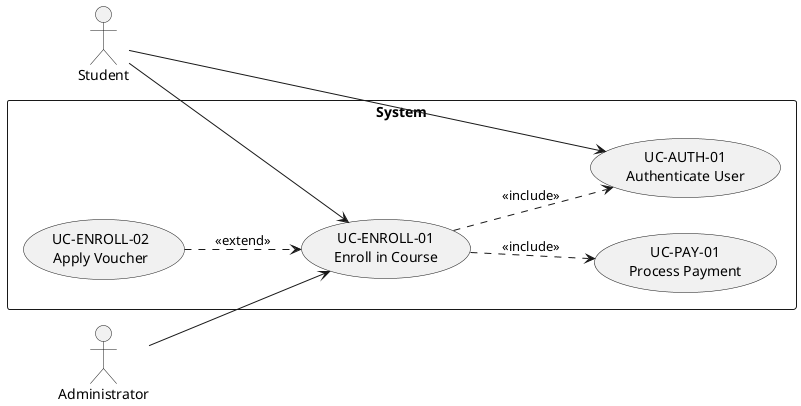
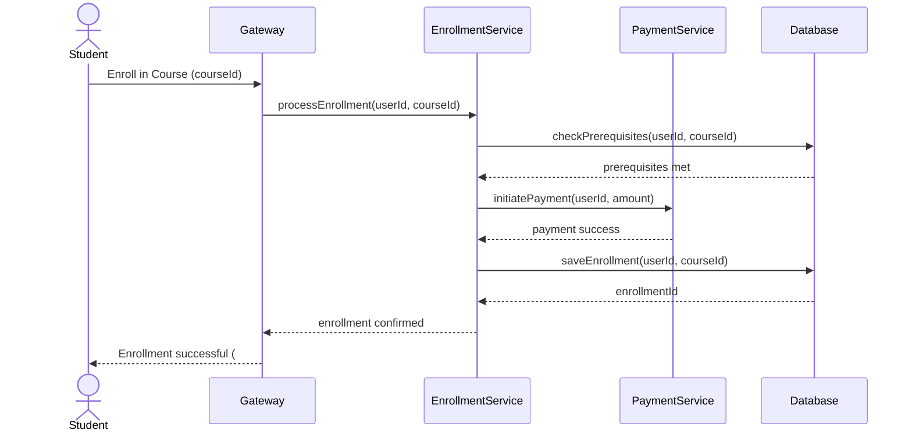

# writing-srs

Generate comprehensive Software Requirements Specification (SRS) documents with use case specifications, use case diagrams, and sequence diagrams.

## Core Rules

### 1. Use Case Naming Convention

All use cases use consistent naming. Immutable rules:

| Rule | Example ✅ | Anti-pattern ❌ |
|------|-----------|----------------|
| Verb + Object (active voice) | "Enroll in Course", "Generate Invoice" | "Enrollment", "Course Management" |
| No actor in name | "Submit Leave Request" | "Employee submits leave" |
| User-goal level only (coffee-break test) | "Book Flight Ticket" | "Validate Credit Card Number" |
| UC ID format: `UC-{MODULE}-{SEQ}` | UC-AUTH-01, UC-ORDER-03 | UC1, usecase_1 |
| Name matches diagram label exactly | UC name = PlantUML usecase label | "Register" in text, "Sign Up" in diagram |

### 2. Use Case Diagram Rules (include/extend)

Use case diagrams rendered via PlantUML. Relationships:

| Relationship | Syntax | When to use |
|-------------|--------|-------------|
| **include** (`<<include>>`) | `UC_A ..> UC_B : <<include>>` | UC_A always calls UC_B as part of its flow. UC_B is mandatory. |
| **extend** (`<<extend>>`) | `UC_B ..> UC_A : <<extend>>` | UC_A optionally extends UC_B. UC_B is complete without UC_A. |
| **Actor association** | `Actor --> UC` | Actor initiates the use case |

**Rules:**
- No `<<include>>` from actor to use case
- No circular include/extend chains
- Each actor-UC association must match a use case specification
- Include direction: base UC → included UC (arrow points to what's included)
- Extend direction: extending UC → base UC (arrow points to the base being extended)



### 3. Use Case Specification Format

Each use case uses the 13-field template with **main flow and alternative flows in table format**.

```markdown
| **Use Case ID:**        | UC-XX-YY                    |
| **Use Case Name:**      | Verb + Object               |
| **Created By:**         |           | **Last Updated By:** |           |
| **Date Created:**       |           | **Date Last Updated:** |           |

| **Actor:**              | Primary Actor / Secondary Actors |
| **Description:**        | 2-3 sentences: why + what + outcome |
| **Preconditions:**      | 1. System state before UC starts |
| **Postconditions:**     | 1. System state after UC success |
| **Priority:**           | High / Medium / Low |
| **Frequency of Use:**   | X times per day/week/month |
| **Includes:**           | UC-XX-YY, UC-AA-BB |
| **Special Requirements:** | Non-functional constraints |
| **Assumptions:**        | 1. Unverified beliefs |
| **Notes and Issues:**   | TBD items with owner/due date |
```

#### Main Flow Table

| Step | Actor | System Response |
|------|-------|-----------------|
| 1 | Actor does [action] | |
| 2 | | System responds with [response] |
| 3 | Actor selects [option] | |
| 4 | | System validates and displays [result] |
| ... | ... | ... |

#### Alternative Flow Table

Each alternative flow references the step where it diverges:

**AC.1: [Alternative Name]** — At step X, if [condition]:

| Step | Actor | System Response |
|------|-------|-----------------|
| AC.1.1 | Actor does [action] | |
| AC.1.2 | | System responds with [response] |

**EX.1: [Exception Name]** — At step X, if [failure condition]:

| Step | Actor | System Response |
|------|-------|-----------------|
| EX.1.1 | | System displays error message |
| EX.1.2 | | System returns to step X-1 |
| **Final state:** [what happens after exception] | | |

### 4. Sequence Diagram for Each Use Case

Every use case generates a corresponding Mermaid sequence diagram from the main flow table.

**Generation rules:**
- Primary actor = first participant
- System boundary = box with internal participants
- Each main flow step = one sequence arrow
- Alternative flows = `alt/else` blocks
- Database entities shown as separate lifelines



## Workflow

```
1. Identify Actors        → List all actor roles
2. Identify Use Cases     → Apply 3 techniques (goal-driven, event-driven, CRUD-driven)
3. Scope Check            → Coffee-break test, Cockburn's goal levels
4. Write UC Specs         → One at a time, 13-field template with flow tables
5. Draw UC Diagram        → PlantUML with correct include/extend
6. Draw Sequence Diagrams → One Mermaid SD per use case
7. Run Quality Checklist  → 20-point validation per UC
8. Assemble SRS Document  → All UCs + diagrams → markdown → HTML report
```

## Integration with open-report

1. **Skill `use-case-writer`** (phucnt-bazone-vietnam) handles individual UC writing
2. **Skill `writing-srs`** (this file) handles SRS document structure, UC diagram, SD generation
3. **Subagent `srs-writer`** orchestrates UC writing + diagram generation
4. **Subagent `diagram-renderer`** renders PlantUML UC diagrams and Mermaid SDs
5. **Command `/generate-report`** includes SRS as content type

## Output Structure

```
output/srs/
  srs-content.md            # Full SRS document in markdown
  use-cases/
    UC-AUTH-01-authenticate-user.md
    UC-ENROLL-01-enroll-in-course.md
    UC-ENROLL-02-apply-voucher.md
  diagrams/
    usecase-diagram.svg     # PlantUML use case diagram
    sd-UC-ENROLL-01.svg     # Sequence diagram per UC
    sd-UC-ENROLL-02.svg
```

## Quality Checklist (20-point)

Adapted from Karl Wiegers / IIBA / Cockburn:

### Scope & Identification (C1-C5)
- C1: UC Name follows "Verb + Object", active voice
- C2: UC at user-goal level (passes coffee-break test)
- C3: UC ID unique, follows UC-{MODULE}-{SEQ}
- C4: Exactly 1 primary actor, 1 clear business goal
- C5: System boundary matches UC diagram rectangle

### Actor & Context (C6-C8)
- C6: Actor is specific role, not "User"
- C7: Description answers WHY + WHAT + OUTCOME
- C8: Frequency quantified (not "sometimes")

### Pre/Post Conditions (C9-C11)
- C9: Preconditions verifiable, not disguised business rules
- C10: Postconditions cover success state and system changes
- C11: Preconditions not confused with Assumptions

### Main Flow (C12-C15)
- C12: Table format: Step | Actor | System Response
- C13: Alternates Actor/System, clear subjects
- C14: No embedded if/else/loop in main flow
- C15: Flow runs trigger-to-postcondition (no dangling step)

### Alternative & Exception (C16-C18)
- C16: Each AC specifies "at step N" + condition, uses table format
- C17: Each EX has trigger + system response + final state
- C18: Common failures covered (timeout, invalid, network, auth, concurrency)

### Completeness (C19-C20)
- C19: Includes fields point to existing UC IDs
- C20: Special Requirements don't duplicate functional requirements
- C21: UC diagram has correct include/extend arrows
- C22: Sequence diagram matches main flow table step-by-step

## Anti-Patterns

- UC Name with "Manage/Handle/Process" — too vague
- UC diagram with include from actor to UC — invalid PlantUML
- Missing extend for optional functionality — crammed into main flow
- Main flow with if/else embedded — goes in alternative flow table
- Sequence diagram missing alt/else blocks — alternative flows not shown
- UC ID mismatch between spec, diagram, and sequence diagram
